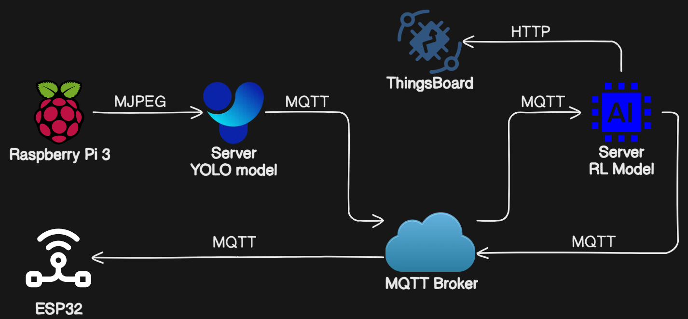

# 🚦 Adaptive Traffic Light System

[](https://opensource.org/licenses/Apache-2.0)
[](https://www.python.org/)
[](https://www.eclipse.org/sumo/)
[](https://ultralytics.com/yolov8)

An intelligent traffic management system that uses computer vision and reinforcement learning to optimize traffic light timing based on real-time vehicle detection.

## 🌐 System Architecture

### IoT Reference Model


This diagram shows the core components of our IoT system:
- **Raspberry Pi** with camera captures and streams video
- **YOLO Model Server** processes the stream for vehicle detection
- **Reinforcement Learning Server** makes traffic light decisions
- **ESP32 Microcontroller** controls physical traffic lights
- **MQTT Broker** facilitates communication between components
- **ThingsBoard** for IoT dashboard and monitoring

### Workflow Diagram


The end-to-end workflow:
1. Street cameras capture real-time traffic footage
2. Video streams are processed by the YOLO model for vehicle detection
3. Traffic data is analyzed by the Reinforcement Learning model
4. Optimal traffic light phases are determined
5. Commands are sent to:
   - SUMO for simulation updates
   - ESP32 controllers for physical lights
6. Traffic signals adapt based on current conditions

## 📌 Features

- **Real-time Vehicle Detection**: Uses YOLOv8 model to detect and classify vehicles from camera streams
- **Adaptive Traffic Control**: Implements Q-learning algorithm to optimize traffic light phases
- **Multi-Platform Support**: Works with Raspberry Pi cameras, USB cameras, and video files
- **IoT Integration**: Controls physical traffic lights via MQTT and Arduino
- **Simulation Environment**: Includes SUMO traffic simulation for testing and development
- **Modular Architecture**: Separates components for easy maintenance and extension

## 🗂 Project Structure

```
adaptive-traffic-light/
│   .gitignore
│   config.py              # Configuration loader
│   README.md
│   requirements.txt
│   
├───IoT
│   │   camera.py          # Camera streaming server
│   │   setup.md           # Raspberry Pi setup guide
│   │   
│   └───lights_controller
│           lights_controller.ino  # Arduino traffic light controller
│           
├───SUMO
│   │   generate_vehicles.py       # SUMO vehicle generator with RL
│   │   
│   ├───config
│   │       simulation.sumocfg     # SUMO configuration
│   │       
│   ├───network
│   │       simple.add.xml         # Additional network elements
│   │       simple.edg.xml         # Edge definitions
│   │       simple.nod.xml         # Node definitions
│   │       
│   └───routes
│           random_routes.rou.xml  # Vehicle routes
│           
└───Yolo_model
        read_pic_model.py          # Image vehicle detection
        read_streaming_model.py    # Live stream detection
        read_video_model.py        # Video file detection
```

## 🛠 Installation

### Prerequisites

- Python 3.8+
- SUMO (≥1.15.0)
- Arduino IDE (for hardware controller)
- Raspberry Pi (optional for physical deployment)

### Setup

1. Clone the repository:
   ```bash
   git clone https://github.com/minhphuc2544/Adaptive-Traffic-Light.git
   cd Adaptive-Traffic-Light
   ```

2. Install Python dependencies:
   ```bash
   pip install -r requirements.txt
   ```

3. Set up environment variables in `.env`:
   ```ini
   MQTT_BROKER_IP=your_broker_ip
   MQTT_PORT=1883
   MQTT_TOPIC_TRAFFIC=iot/traffic
   MQTT_TOPIC_RANDOM_TRAFFIC=iot/random_traffic
   MQTT_TOPIC_RESPONSE=iot/response
   PI_CAMERA_URL=http://raspberrypi.local:8080/stream
   ```

4. For Raspberry Pi setup, follow the [IoT/setup.md](IoT/setup.md) guide.

## 🚀 Usage

### Running the Simulation

1. Start SUMO with the configuration:
   ```bash
   sumo-gui -c SUMO/config/simulation.sumocfg
   ```

2. Run the vehicle generator with RL controller:
   ```bash
   python SUMO/generate_vehicles.py
   ```

### Using the Camera System

1. Start the camera streamer (on Raspberry Pi):
   ```bash
   python IoT/camera.py
   ```

2. Run vehicle detection on the stream:
   ```bash
   python Yolo_model/read_streaming_model.py
   ```

### Controlling Physical Lights

1. Upload `lights_controller.ino` to your ESP32
2. The controller will automatically connect to MQTT and respond to phase changes

## 🤖 Tech Stack

- **Computer Vision**: YOLOv8, OpenCV
- **Simulation**: SUMO, TraCI
- **IoT**: MQTT, ESP32 (Arduino)
- **Reinforcement Learning**: Q-learning with state discretization
- **Edge Computing**: Raspberry Pi with PiCamera
- **Tracking**: Norfair object tracking

## 📊 MQTT API Reference

| Topic              | Direction   | Format                          | Description |
|--------------------|-------------|---------------------------------|-------------|
| `iot/traffic`      | Camera → RL | `{"vehicles": {"car": 3, ...}}` | Vehicle counts from detection |
| `iot/random_traffic` | SUMO → UI  | `{"traffic": {"W2TL": {...}}}`  | Simulated traffic data |
| `iot/response`     | RL → Lights | `{"phase": "EW_green", ...}`    | Traffic light phase commands |

## 🤝 Contributing

1. Fork the project
2. Create your feature branch (`git checkout -b feature/AmazingFeature`)
3. Commit your changes (`git commit -m 'Add some amazing feature'`)
4. Push to the branch (`git push origin feature/AmazingFeature`)
5. Open a Pull Request

## 📜 License

Distributed under the Apache License 2.0. See `LICENSE` for more information.

## 🙏 Credits

- SUMO for traffic simulation capabilities
- Ultralytics for YOLOv8 model
- Norfair for object tracking